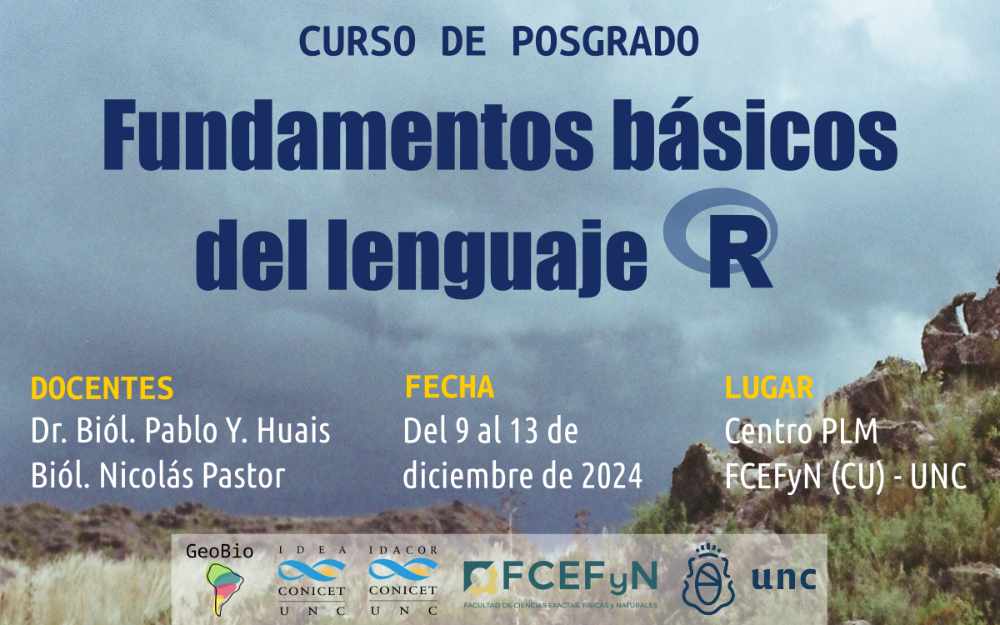

```{r setup, include=FALSE}
knitr::opts_chunk$set(echo = TRUE)
```

<p align="center">



</p>

## Índice de contenidos

-   **Día 1**
    -   [1.1 Introducción al lenguaje R](dia1/1.1_IntroR.pdf)
    -   [1.2 Primeros pasos con R y RStudio](dia1/1.2_UsandoR.html)
    -   [2.1 Flujo de trabajo](dia1/2.1_FlujoTrabajo.html)
    -   [3.1 Operadores](dia1/3.1_Operadores.html)
    -   [3.2 Vectores](dia1/3.2_Vectores.html)
-   **Día 2**
    -   [4.1 Tablas y estructuras complejas](dia2/4.1_Tablas.html)
-   **Día 3**
    -   [5.1 Control de flujo](dia3/5.1_control_flujo.html)
    -   [5.2 Funciones](dia3/5.2_Funciones.html)
-   **Día 4**
    -   [6.1 Gráficos básicos](dia4/6.1_graficos_base.html)
    -   [6.2 Gráficos con *ggplot2*](dia4/6.2_ggplot2.html)

**Descarga todo el material del curso [aquí](https://github.com/pastornicolas/fundamentos_R/archive/refs/heads/main.zip)**

[**Código colaborativo!**](code_form.html)

<!--  [**Link a la evaluación**](dia5/Evaluacion.html) -->

-------------------------------------

## Cronograma

<p align="center">


</p>

### Otros cursos orientados al uso de R

En el Doctorado de Ciencias Biológicas (FCEFyN, Universidad Nacional de Córdoba), se dictan con regularidad cursos introductorios y avanzados de modelos estadísticos en R:

-   **Introducción al lenguaje R. Modelos lineales y fundamentos de programación**. [Ver curso](https://curso-statscba.github.io/curso-R/){target="_blank"}
-   **Modelos Estadísticos Avanzados**. [Ver curso](https://curso-statscba.github.io/modelos_avanzados/){target="_blank"}
-   **Otros recursos:** existe una disponibilidad asombrosa de recursos digitales libres para aprender R, tanto en español como en inglés. Al final de la clase introductoria de este mismo curso brindamos una breve lista de refrencia. [Ir a clase introductoria](dia1/1.1_IntroR.pdf)

-------------------------------------

## Licencia

© 2024 Pablo Y. Huais & Nicolás Pastor. Bajo licencia [Creative Commons Attribution-NonCommercial-ShareAlike 4.0 International License](http://creativecommons.org/licenses/by-nc-sa/4.0/).

[](http://creativecommons.org/licenses/by-nc-sa/4.0/)
