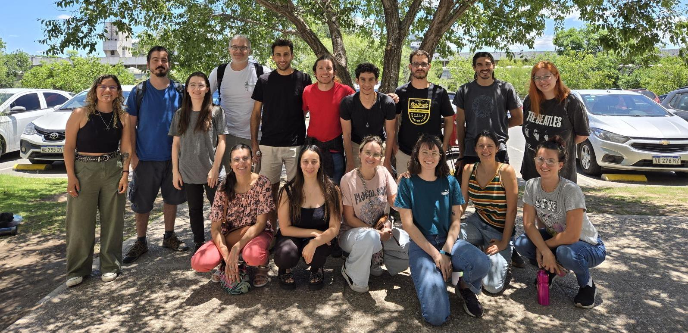

# Fundamentos básicos del lenguaje R

Curso de posgrado | FCEFyN - UNC

<i>Edición 2024</i>

# ¡Bienvenid@s al curso!

Bienvenid@s al curso de **Fundamentos básicos del lenguaje R**, dictado
por el Dr. Pablo Yair Huais y el Biól. Nicolás Pastor. El curso fue
diseñado para proveer a l@s estudiantes con las herramientas necesarias
para iniciarse en el uso del lenguaje R, mediante el aprendizaje de su
lógica programática, y orientado a resolver problemas específicos de sus
temas de investigación.

[Haz click aquí para acceder a la página con los contenidos del
curso](https://curso-statscba.github.io/fundamentos_R/)

# Otros cursos de interés

En el Doctorado de Ciencias Biológicas (FCEFyN, Universidad Nacional de
Córdoba), se dictan con regularidad cursos introductorios y avanzados de
modelos estadísticos en R:

-   **Introducción al lenguaje R. Modelos lineales y fundamentos de
    programación**  Dictado por el Dr. Santiago Benitez-Vieyra.
    <a href="https://curso-statscba.github.io/curso-R/" target="_blank">Ver
    curso</a>
-   **Modelos Estadísticos Avanzados**  Dictado por el Dr. Santiago
    Benitez-Vieyra.
    <a href="https://curso-statscba.github.io/modelos_avanzados/"
    target="_blank">Ver curso</a>
-   **Gráficos para publicaciones en R con énfasis en *ggplot2***
     Dictado por el Dr. Andrés Blanco.
    <a href="https://andresblanco-unc.github.io/curso_graficos_ggplot/"
    target="_blank">Ver curso</a>

# Licencia

© 2024-2025 Pablo Y. Huais & Nicolás Pastor. Bajo licencia [Creative Commons
Attribution-NonCommercial-ShareAlike 4.0 International
License](http://creativecommons.org/licenses/by-nc-sa/4.0/).

