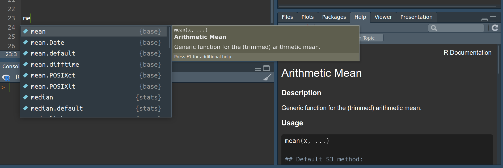

```{=html}
<style>body {text-align: justify};</style>
```

<style>
  h1.title { display: none; }
</style>

<a id='top'></a>

::: {style="text-align: right;"}
[Volver al inicio](../)
:::

# Primeros pasos con R y RStudio

## ¿Cómo se usa R?

R puede ser utilizado de forma interactiva iniciándolo directamente de cualquier [terminal de BASH](https://es.wikipedia.org/wiki/Bash){target="_blank"} (en sistemas <i>UNIX-like</i>), o desde el ["Simbolo del sistema"](https://es.wikipedia.org/wiki/S%C3%ADmbolo_del_sistema_de_Windows){target="_blank"} o haciendo doble click en el ejecutable típicamente localizado en "<i>C:\\Program Files\\R\\R-<i>version</i>\\bin\\x64\\</i>" (en sistemas Windows). Por ejemplo en cualquier distribución GNU/Linux, bastará con abrir la terminal e ingresar el comando "R".

<p align="center"><a href="pics/r_inter.png" target="_blank"> </a><br><i><sup>Click en la imagen para agrandar.</sup></i></p>

Cuando R es iniciado de esa forma, veremos un texto con una pequeña presentación de R, incluyendo la versión que se está ejecutando y algunas ayudas básicas. Luego de este texto, vemos una linea vacía comenzada por el carácter `>`. Este último carácter se conoce como <i>prompt</i> y nos indica que R está listo para recibir órdenes. Así pues, podríamos pedir que nos imprima una bienvenida al curso utilizando la función `print()`, haciendo por ejemplo:

```{r, eval=FALSE, echo=TRUE}
print("Bienvenides al curso!!!")
```

<p align="center"><a href="pics/r_inter2.png" target="_blank"> </a><br><i><sup>Click en la imagen para agrandar.</sup></i></p>

Aún funcionando desde un [CLI](https://es.wikipedia.org/wiki/Interfaz_de_l%C3%ADnea_de_comandos){target="_blank"}, sin una interfaz gráfica, debido a que R está pensado para funcionar en sistemas de ventanas, es posible realizar gráficos y estos se mostraran en una nueva ventana exclusivamente creada para tal fin. Podríamos por ejemplo graficar 3 puntos de diferentes colores, ubicados en las coordenadas `(x,y)=(1,1 ; 2,1 ; 3,1)`:

```{r, eval=FALSE, echo=TRUE}
plot(1:3, rep(1,3), pch=16, col=c("blue","red","black"), cex=5)
```

<p align="center"><a href="pics/r_inter3.png" target="_blank"> </a><br><i><sup>Click en la imagen para agrandar.</sup></i></p>

Como al usar R de esta forma solo podremos ir ejecutando de a una orden a la vez, puede ser conveniente disponer de algún editor de [texto plano](https://es.wikipedia.org/wiki/Archivo_de_texto){target="_blank"} para poder ir guardando nuestro código a medida que lo vamos escribiendo y ejecutando. Para ello podemos utilizar cualquier editor de texto plano (e.g., en GNU/Linux podemos usar "[gedit](https://help.gnome.org/users/gedit/stable/index.html.es){target="_blank"}" o el editor que traiga nuestra distribución; en Windows podemos utilizar "[Bloc de Notas](https://apps.microsoft.com/detail/9msmlrh6lzf3?hl=en-us&gl=US#activetab=pivot:overviewtab){target="_blank"}", "[Notepad++](https://notepad-plus-plus.org/){target="_blank"}", etc). Aprovechando el espacio del escritorio de nuestra PC podríamos entonces hacer una disposición con las ventanas abiertas de nuestra terminal donde ejecutamos R, la ventana gráfica donde se mostrarán nuestros gráficos, el archivo de texto plano con nuestro código y podríamos sumar también una ventana con las carpetas donde estamos guardando el trabajo y desde donde leeremos los datos que cargaremos a R. Algo parecido a lo siguiente:

<p align="center"><a href="pics/r_inter4.png" target="_blank"> </a><br><i><sup>Click en la imagen para agrandar.</sup></i></p>

Finalmente, si deseamos salir de la sesión de R activa, podemos utilizar la función `quit()` (o su forma abreviada `q()`), a lo que R responderá preguntando si queremos guardar una <i>imagen del espacio de trabajo</i>, a lo que responderemos que NO ingresando `n`. Esto cerrara cualquier ventana gráfica que hubiera abierta, así como en nuestra terminal veremos que el <i>prompt</i> vuelve a ser el de nuestro sistema.

####  {#anch1}

<p align="center"><a href="pics/r_inter5.png" target="_blank"> </a><br><i><sup>Click en la imagen para agrandar.</sup></i></p>

#### <ins>Ejercicio 1</ins>

Abra R desde una terminal de su sistema operativo e intente replicar las líneas de código mostradas en la parte previa, de paso, sabremos que su sistema tiene correctamente instalado R.

------------------------------------------------------------------------

### Presentando a RStudio

A pesar de lo sencillo que resulta usar R nativamente en cualquier sistema, para ahorrarnos tener que usar múltiples programas en simultáneo, así como para sumar toda una gran colección de funcionalidades y herramientas que nos facilitarán mucho el trabajo, es recomendable utilizar R en conjunto con alguna [IDE](https://es.wikipedia.org/wiki/Entorno_de_desarrollo_integrado){target="_blank"}. En este curso, utilizaremos [RStudio](https://posit.co/products/open-source/rstudio/){target="_blank"}.

<p align="center"><a href="pics/r_stud_let.png" target="_blank"> </a><br><i><sup>Click en la imagen para agrandar.</sup></i></p>

En la figura precedente podemos identificar rápidamente las principales áreas de trabajo con diferentes funcionalidades que nos ofrece el programa (estos paneles pueden maximizarse, minimizarse o redimensionarse a gusto con el puntero del <i>mouse</i>, así como personalizarse en "<i>Tools</i> \> <i>Global Options</i> \> <i>Pane Layout</i>"):

<ol>
<li style="font-weight:bold;">Consola: [una consola de R equivalente a la que iniciamos previamente y con la misma funcionalidad.]{style="font-weight:normal;"}</li>
<li style="font-weight:bold;">Fuente: [equivalente al editor de texto plano (este panel puede no abrirse por defecto si todavía no creamos ninguna rutina, para ello hacer "<i>File</i> \> <i>New File</i> \> <i>R Script</i>" o click en el botón {width="24"} [**a**])]{style="font-weight:normal;"}</li>
<li style="font-weight:bold;">Entorno: [muestra todos los objetos creados ordenados por tipo, permite la carga de dataset gráficamente y la gestión de la memoria en uso.]{style="font-weight:normal;"}</li>
<li style="font-weight:bold;">Archivos, Gráficos, Paquetes, Ayuda: [esta es una área de mucho uso ya que permite ver y manipular el sistema de archivos dónde estamos trabajando [**b**], así como gestionar los paquetes de R gráficamente [**c**]. Además, cambiará automáticamente al área gráfica cuando realicemos un gráfico [**d**] y cambiará a las ayudas internas disponibles en caso de solicitarlo [**e**].]{style="font-weight:normal;"}</li>
</ol>

Cuando tengamos una rutina (i.e. un *script*) creada, podremos ejecutar directamente desde la misma el código sin necesidad de "<i>copiar y pegar</i>" en la consola de R. Para ello, con el cursor de texto sobre la linea de código podemos utilizar el botón {width="24"} `Run` ubicado en el sector superior derecho del panel *Fuente*, o utilizar el atajo de teclado `Ctrl + Enter`. Esto mismo podemos hacerlo sobre varias líneas, seleccionando con el cursor todas aquellas líneas que querramos ejecutar.

**Para prestar atención:** un *script* no es más que una serie ordenada de órdenes que se ejecutan una tras otra. Por defecto, siempre que ejecutemos un *script* completo, no importa si lo hacemos <i>línea a línea</i> o seleccionado todo el conjunto, la ejecución subyacente es secuencial. Para romper este comportamiento existen estructuras especiales conocidas como "<i>Estructuras de control de flujo</i>", que estudiaremos más adelante.

**Para pensar:** en el ejemplo de la figura previa existen líneas que comienzan con un carácter `#` (llamado de muchas formas: numeral, almohadilla, <i>hashtag</i>). Si presta atención, esas líneas están coloreadas de forma homogénea en el editor y, además, aparentan tener mensajes que explican el código. ¿Qué imagina que sucede cuando se ejecutan? ¿Cómo se llama y qué función cumplen esas líneas? Más adelante veremos otra forma adicional de utilizarlas para organizar nuestro código en RStudio.

#### *Proyectos en RStudio*

Una de las primeras nociones sobre las <i>buenas prácticas</i> de trabajo es intentar mantener una organización coherente de nuestro código, así como de los archivos de entrada (i.e. los datos) y salida (i.e. resultados, gráficos, etc). Aunque estrictamente no existe una forma única ni correcta de organización y cada persona debe encontrar lo que le resulta más práctico, siempre debemos considerar que existen potenciales receptores de nuestro código que idealmente tendrían que interpretar con el menor esfuerzo posible la organización seguida. Incluso podemos ser nosotros mismos quienes en un futuro revisitemos algo que hicimos hace un tiempo y le estaremos enormemente agradecidos a nuestra versión del pasado por haber mantenido una organización coherente.

Cuando trabajamos con RStudio, esto último puede ser muy sencillo de realizar utilizando los *proyectos*, que no son otra cosa más que una forma de mantener nuestro trabajo en un contexto dado, con su propio directorio de trabajo, historial, rutinas, entradas, salidas, etc. De esta forma, pensemos por ejemplo en una organización con una estructura hipotética similar a la siguiente:

####  {#anch2}

```         
AnalisisTesis
  |
  |-- CapII
  |     |
  |     |-- datos
  |     |     |-- muestreoEne-Mar.csv
  |     |     |-- muestreoAgo-Oct.csv
  |     |      
  |     |--resultados
  |     |     |-- diversidad.txt
  |     |     |-- composicion.txt
  |     |     |-- graficos
  |     |            |-- fig_div_estacion.pdf
  |     |            |-- fig_NMDS.pdf
  |     |
  |     |-- analisis
  |           |-- exploratorios.R
  |           |-- anova.R
  |           |-- NMDS.R
  |-- CapIII
  |     |
  |    ...
 ...
```

En este caso, podríamos entonces pensar en crear un proyecto para todo el conjunto de "AnalisisTesis" o podemos subdividir y crear un proyecto por cada capítulo que requiera realizar algun tipo de análisis. De nuevo, no hay una manera única, todo dependerá del contexto y lo que resulte -o parezca resultar- óptimo en cada situación.

Existen múltiples formas de crear un nuevo proyecto. Podemos hacer "<i>File</i> \> <i>New Project...</i>"; podemos usar el botón {width="24"} en la esquina superior izquierda; o utilizar el menú de proyectos {width="20"} `Project: (None)`, situado en la esquina superior derecha. A la hora de crear un nuevo proyecto, podemos elegir partir de un directorio nuevo o de uno previamente creado. Así mismo, podemos elegir un tipo específico de proyecto según si estemos haciendo un proyecto general, un proyecto para un nuevo paquete de R, una [aplicación Shiny](https://shiny.posit.co/){target="_blank"}, etc. Todo esto se realiza mediante una serie de menús gráficos que se nos irán presentado y que son sumamente intuitivos de seguir.

#### <ins>Ejercicio 2</ins>

Luego de ver la demostración del docente sobre la creación de proyectos en RStudio, abra una sesión propia de RStudio y cree un proyecto para este curso. La organización sugerida es la siguiente:

```         
fundamentosR
  |
  |-- fundamentosR.Rproj
  |-- dia1
  |     |-- mi_rutinaR.R
  |
  |--dia2
  |--dia3
 ...
```

A medida que el curso avance, iremos completando estos directorios con datos, rutinas, etc.

#### <ins>Ejercicio 3</ins>

Cree una rutina dentro de `dia1`, como se muestra en la estructura precedente, que contenga el código ejecutado en el [Ejercicio 1](#anch1) para el mensaje de bienvenida y el gráfico. Corra esas líneas y explore las funciones del panel gráfico. Finalmente, guarde el mismo como un archivo `PNG` dentro del directorio `dia1`.

#### *El directorio de trabajo*

Cuando trabajamos con R, implícitamente lo estamos haciendo en alguna ubicación de nuestro sistema de archivos. Los proyectos de RStudio facilitan esta cuestión haciendo que el *directorio de trabajo* sea aquel en el cual creamos el proyecto. Para conocer en donde estamos trabajando, podemos utilizar la función `getwd()`. Por ejemplo, mientras escribo esta guía puedo ver en qué ubicación se encuentra el proyecto en la cual la estoy realizando (Sí! R es tan versátil, que hasta podemos crear páginas web y cualquier otro tipo de documento con su propio formato, imágenes embebidas, vínculos de internet, etc.):

```{r}
getwd()
```

Si por algun motivo deseara cambiar el directorio de trabajo, puedo hacerlo desde el menú "<i>Session</i> \> <i>Set Working Directory</i> \> <i>Choose Directory</i>" o, de forma más sencilla, utilizar la función `setwd()`:

```{r warning=FALSE}
setwd("/home/usuario/R/mi_proyecto_de_R") # ejecución sin salida en consola
getwd() # muestra el nuevo working directory
setwd("/home/usuario/cursoR/clases/1_2_usandoR/") # regreso al original
getwd() # muestra el nuevo working directory
```

#### *Rutas relativas y absolutas*

Una ruta (en inglés <i>path</i>) en R o en cualquier otro sistema informático es la "dirección" de cada archivo que existe en el sistema de archivos. De forma general, existen dos formas de representar a cualquier ruta:

-   Las **rutas absolutas** son aquellas en las que explícitamente se indica todo el trayecto realizado desde la ráiz del sistema hasta la ubicación en cuestión. En los sistemas GNU/Linux, la raíz del sistema es `/` (llamado **root**); mientras que en los sistemas Windows será el origen del disco que este utilizándose, típicamente `C:\`. Teniendo esto en cuenta, la ruta anterior al directorio de trabajo es una ruta absoluta, ya que en la misma se explicita toda la ruta desde la raíz hasta el archivo.

-   Las **rutas relativas** por su parte, nos muestran la ubicación de un archivo o directorio en sentido relativo al directorio de trabajo activo. Generalmente, las mismas empiezan con uno o dos caracteres de punto ".", teniendo la expresión `./` el significado literal de "en este directorio", es decir, en el directorio actual; mientras que la expresión `../` indica el directorio superior en la jerarquía del directorio actual. Tener en cuenta que en sistemas Windows, el caracter que separa directorios es la "<i>barra inversa</i>", por lo que en esos sistemas será: `.\` y `..\`.

Como ejemplo, tomando como referencia la [estructura sugerida](#anch2) para el proyecto de los analisis de la tesis, si el directorio de trabajo activo fuera `analisis` dentro de `CapII`, la ruta relativa a `CapIII` seria `../../CapIII`

#### <ins>Ejercicio 4</ins>

Imagine que dentro del directorio `/home/usuario/Documentos`, posee la siguiente estructura de directorios:

```         
carpeta0/
├── archivo0_a
├── archivo0_b
├── carpeta1
│  ├── archivo1_a
│  ├── archivo1_b
│  └── archivo1_c
└── carpeta2
    ├── archivo2_a
    ├── archivo2_b
    └── carpeta2a
        ├── archivo2a_a
        └── carpeta2b
            └── archivo2b_a     
```

-   ¿Cuál sería la ruta absoluta al archivo "archivo1_c"?

```{r, echo=FALSE}
# Define the correct answer in R
correct_answer <- "/home/usuario/Documentos/carpeta0/carpeta1/archivo1_c"
```

::: {#app}
<label for="userText">Su respuesta:</label> <input type="text" id="userText" placeholder="Escriba su respuesta aquí" size="80%"> <button onclick="checkAnswer()">OK</button>

<p id="result"></p>
:::

```{=html}
<script>
  // Use the correct answer defined in R
  const correctAnswer = "`r correct_answer`";

  function checkAnswer() {
    // Get the user's input text
    const userText = document.getElementById("userText").value;
    // Check if the input matches the correct answer
    if (userText === correctAnswer) {
      document.getElementById("result").innerText = "Correcto!";
      result.style.color = "green"; result.style.fontWeight = "bold";
    } else {
      document.getElementById("result").innerText = "Incorrecto. Por favor, intente nuevamente.";
      result.style.color = "red"; result.style.fontWeight = "bold";
    }
  }
</script>
```
-   ¿Cómo sería la ruta relativa desde el directorio "carpeta2b" hacia el archivo "archivo1_c"?

```{r, echo=FALSE}
# Define the correct answer in R
correct_answer2 <- "../../../carpeta1/archivo1_c"
```

<div>

<label for="userText">Su respuesta:</label> <input type="text" id="userText2" placeholder="Escriba su respuesta aquí" size="80%"> <button onclick="checkAnswer2()">OK</button>

<p id="result2">

</p>

</div>

```{=html}
<script>
  // Use the correct answer defined in R
  const correctAnswer2 = "`r correct_answer2`";

  function checkAnswer2() {
    // Get the user's input text
    const userText2 = document.getElementById("userText2").value;
    // Check if the input matches the correct answer
    if (userText2 === correctAnswer2) {
      document.getElementById("result2").innerText = "Correcto!";
      result2.style.color = "green"; result2.style.fontWeight = "bold"; 
    } else {
      document.getElementById("result2").innerText = "Incorrecto. Por favor, intente nuevamente.";
      result2.style.color = "red"; result2.style.fontWeight = "bold";
    }
  }
</script>
```

#### *Las rutas en los proyectos de RStudio*

Cuando trabajamos dentro de un proyecto de RStudio, todas las rutas son relativas a la raíz del proyecto. Esto tiene algunas ventajas, como por ejemplo si compartimos nuestro proyecto con colaboradores, estos no necesitarán configurar las rutas para su sistema, ya que las rutas se mantienen relativas al proyecto. Por otro lado, no es necesario que anonimicemos nuestras rutas, ya que si trabajamos exclusivamente dentro de la carpeta raíz del proyecto, no debería aparecer ninguna ruta absoluta. Las razones por las que quisiéramos mantener nuestras *otras* carpetas internas privadas son muchas, y variarán en cada caso, pero para un ejemplo interesante podemos considerar el siguiente caso:

<p align="center">
<a href="pics/r_paths.png" target="_blank"> </a><br><i><sup>Click en la imagen para agrandar.</sup></i>
</p>

Por cierto, Alexandra es, ni más ni menos, la creadora del sitio [Sci-Hub](https://www.sci-hub.se/){target="_blank"} y esa captura corresponde a una guía básica para voluntarias/os de [Anna's Archive](https://es.wikipedia.org/wiki/Archivo_de_Anna){target="_blank"}.

------------------------------------------------------------------------

### Buscando ayuda en R

Una de las cosas que más intimidan a quienes intentan aprender un lenguaje de programación suele ser intentar recordar el nombre de todas las funciones disponibles y cómo se usa exactamente cada una. Pero lo cierto es que esto rara vez preocupa a quienes llevan un tiempo inmersos en algún lenguaje. Esto es así, ya que como el resto de los lenguajes más populares, R posee un compendio de documentación interna que explica detalladamente cada una de sus funciones. Esta ayuda se encuentra disponible desde la instalación de R, así como de cada uno de los paquetes oficiales, y puede ser consultada incluso *fuera de línea* (i.e. sin conexión a internet).

Existen múltiples formas de consultar esta documentación. Si nos encontramos trabajando directamente desde una consola de R, podremos invocar la ayuda con la función `help(funcion)`, donde `funcion` es el nombre de la función o el objeto sobre el que estamos requiriendo la documentación. Por ejemplo, con la formula `help(help)` podemos obtener la ayuda de la función de ayuda:

<p align="center"><a href="pics/r_help.png" target="_blank"> </a><br><i><sup>Click en la imagen para agrandar.</sup></i></p>

Así mismo, disponemos de una versión corta de la función previa, que es la función `?funcion` y en caso de que queramos buscar con una palabra clave, ya que no recordamos siquiera el nombre de la función o paquete, podemos utilizar `??palabraclave`.

En RStudio, como ya mencionamos antes, disponemos de un área específica para mostrar la ayuda. Está área se activará automáticamente al solicitar alguna ayuda, e incluso disponemos de una función de *autocompletado* con ayudas en ventanas emergentes. Para activarla, solo debemos comenzar a escribir el nombre de la función y apretar la tecla `Tab ↹`. En la siguiente figura, podemos ver que sucede al comenzar a escribir "`me + Tab ↹`":

<p align="center"><a href="pics/r_help2.png" target="_blank"> </a><br><i><sup>Click en la imagen para agrandar.</sup></i></p>

#### <ins>Ejercicio 5</ins>

En RStudio corra las siguientes líneas de a una y observe que salidas le brinda el programa. Anímese a explorar, no hay nada que pueda romper, haga click aquí y allá, vaya y vuelva. De igual forma, intente utilizar el autocompletado y las ayudas emergentes, fomente su creatividad buscando lo que se le ocurra, o intente averiguar como se usa esa función que hace 2 o 3 semanas que no logra ejecutar sin error. En clase discutiremos que partes componen la ayuda y como interpretarla.

```{r eval=FALSE}
help(help)
?help
??distance
?plot
```

#### *Foros y bitácoras de la comunidad*

Además de estas útiles ayudas *offline*, si contamos con una conexión a internet, por supuesto no dudaremos en hacer uso extensivo de buscadores. Muchas veces, más que saber cómo opera una función en particular, queremos conocer como realizar una acción dada, con el método que sea. Aprender a buscar es en sí mismo un arte. La cantidad de sitios con información sobre R es inabarcable y muchas veces podemos perdernos en el afán de encontrar lo que buscamos, por ello a continuación veremos algunas recomendaciones.

- El idioma en que buscamos importa. Como para cualquier otra búsqueda, no encontraremos los mismos recursos si buscamos en español que si buscamos en inglés.

<p align="center"><a href="pics/r_help3.png" target="_blank"> </a><br><i><sup>Click en la imagen para agrandar.</sup></i></p>

- Existen múltiples foros que incluyen hilos específicos para R, buscar en ellos muchas veces es una forma segura de aprender como hacer algo. La única recomendación en este sentido, aunque no podemos enfatizarla lo suficiente, es que **nunca debemos ejecutar código que no comprendamos**. Si creemos que cierto fragmento de código nos puede ser útil, primero intentemos entenderlo con un ejemplo de juguete, en una sesión nueva, lejos de nuestros scripts de los análisis en curso. Cuando pensemos que hemos podido entender como funciona, entonces ya estamos listos para trasladar ese código a nuestro script. Si no encontramos la respuesta al problema específico que tenemos, en estos foros también podemos realizar una pregunta y nos responderán bastante rápido. La clave es poder expresar concretamente el problema, el resultado esperado y, en la medida de lo posible, brindar un conjunto de datos mínimo que sirva de ejemplo al que realmente queremos procesar. A continuación un ejemplo de [Stack Overflow](https://stackoverflow.com/){target="_blank"}

<p align="center"><a href="pics/r_help4.png" target="_blank"> </a><br><i><sup>Click en la imagen para agrandar.</sup></i></p>

- Ademas de los foros, existe una cantidad inmensa de artículos en sitios webs dedicados a R, así como en blogs personales. Muchas personas, que de hecho investigan en problemas similares a los nuestros, dedican mucho tiempo a publicar métodos de análisis en R, incluyendo muchas veces apartados con explicaciones teóricas sobre ciertos tópicos. Nunca está de más tomarse el tiempo para ver que encontramos. Debajo un ejemplo correspondiente a los materiales de un sitio sobre [Analisis en ecologia de comunidades en R](https://www.davidzeleny.net/anadat-r/doku.php/en:start){target="_blank"}.

<p align="center"><a href="pics/r_help5.png" target="_blank"> </a><br><i><sup>Click en la imagen para agrandar.</sup></i></p>

#### *Los errores como una oportunidad de aprendizaje*

Muy frecuentemente nos encontraremos con errores en la ejecución de alguna línea. Lejos de desanimarnos y/o frustrarnos, debemos pensar que los errores son una oportunidad de aprendizaje. Los errores puede ir desde pequeños errores de tipeo, hasta la falta de memoria de cómputo para la acción requerida, pasando por operaciones imposibles de realizar o falta de argumentos obligatorios en las funciones. En cualquier caso, lo primero que debemos hacer es mantener la calma e intentar **interpretar el mensaje de error**. Si no logramos solucionarlo por nuestra cuenta, siempre podemos copiar el mensaje y ver que ayuda obtenemos en línea. 

```{r error=TRUE}
data(iris)
iris[iris$Sepal.Length > 3]
```
<p align="center"><a href="pics/r_help6.png" target="_blank"> </a><br><i><sup>Click en la imagen para agrandar.</sup></i></p>

**Sobre los *warnings***: ocasionalmente R no producirá un mensaje de error, sino una <ins>*advertencia*</ins>. En estos casos, también es importante que intentemos entender que está ocasionando este mensaje para saber si es algo crítico o no, sobre todo en cuanto a resultados de análisis se refiere.

#### *Uso de IA*

Otra fuente de ayuda en los tiempos modernos, es recurrir al *chatbot* de inteligencia artificial de su preferencia. Una vez más, lo importante es intentar interpretar el código previo a su ejecución. En sentido estricto, podríamos darle nuestros datos a un *chatbot* y pedirle todos los análisis necesarios y, si supimos desmenuzar e indicar nuestra pregunta correctamente, incluso es posible que la salida sea correcta. Dicho esto, estamos aquí para aprender a hacerlo nosotros mismos, por ende, si bien es una fuente más de ayuda, el objetivo es que **aunque el código lo produzca la IA, seamos capaces de entender completamente lo que está sucediendo**.

Fuera de estas consideraciones, podemos preguntar directamente como hacer algo, como en el ejemplo que sigue:

<p align="center"><a href="pics/r_help7.png" target="_blank"> </a><br><i><sup>Click en la imagen para agrandar.</sup></i></p>


O incluso podemos darle algún fragmento de código que falla, y pedirle que intente encontrar el error y explicarnos que es lo que lo esta generando:

<p align="center"><a href="pics/r_help8.png" target="_blank"> </a><br><i><sup>Click en la imagen para agrandar.</sup></i></p>

**Para pensar:** más adelante aprenderemos efectivamente a filtrar una tabla basados en una condición. Recuerde la respuesta brindada por la IA en este ejemplo y veremos luego si es una "buena" respuesta.

------------------------------------------------------------------------

### Instalación y carga de paquetes

A medida que usemos R nos surgirá la necesidad de instalar paquetes por fuera de la versión básica, para añadir funcionalidades extras a R. Esto se puede realizar sencillamente desde RStudio, ya sea utilizando la interfaz gráfica o con funciones especificas para la instalación; así como podemos realizar la instalación desde [CRAN](https://cran.r-project.org/){target="_blank"} o desde repositorios externos (e.g. [GitHub](https://github.com/){target="_blank"}).

#### *Instalación desde CRAN*

La forma más sencilla de instalar paquetes es usando la función `install.packages()`, indicando en el argumento de la función el nombre del paquete. Si no recordamos exactamente el nombre, podemos hacer uso de la función de autocompletado (con la tecla `Tab ↹`). También podemos utilizar el botón {width="20"} para instalar paquetes, en el área correspondiente de RStudio. Si usamos esta última forma, se abrirá una ventana de diálogo, donde podemos indicar el nombre del paquete a instalar.

####  {#anch3}
<p align="center"><a href="pics/r_install.png" target="_blank"> </a><br><i><sup>Click en la imagen para agrandar.</sup></i></p>

Es importante recordar que cuando realicemos la instalación, muchas veces será necesario instalar otros paquetes que son requeridos para que funcione correctamente el paquete que queremos usar. Estos *paquetes necesarios* se conocen como **dependencias** y por defecto R instalará todas las dependencias necesarias. En la siguiente imagen se muestra la descripción de [`vegan`](https://cran.r-project.org/web/packages/vegan/index.html){target="_blank"}, un paquete muy popular para Ecología de Comunidades, dónde podemos ver que *depende* de los paquetes `permute`y `lattice`, en sus versiones mínimas 0.9 y 4.1 respectivamente, así como "*importa*" los paquetes `MASS`, `cluster` y `mgcv`.

<p align="center"><a href="pics/r_install2.png" target="_blank"> </a><br><i><sup>Click en la imagen para agrandar.</sup></i></p>

Dentro de los errores comunes que podemos encontrar tenemos:

- No indicamos entre comillas el nombre del paquete. Recordar que la sintaxis correcta es `install.packages("paquete")` y no `install.packages(paquete)`.

- Queremos instalar múltiples paquetes sin indicar correctamente la lista de paquetes a instalar. Recordar que en ese caso sería `install.packages(c("paquete1", "paquete2", "paquete3"))` utilizando la nomenclatura de un *vector* (más adelante esto tendrá sentido, no se preocupe si ahora no lo entiende).

- Alguna *dependencia* se encuentra en una versión anterior a la necesaria y no puede actualizarse. Esto normalmente se debe a que otro paquete la tiene *fijada* en una versión anterior. Se soluciona, generalmente, reiniciando la sesión de R, actualizando independientemente el paquete en cuestión y luego re-intentando la instalación del paquete objetivo. *Atención*: si un paquete tiende a fijar alguna dependencia en una versión dada, es posible que ese paquete sea viejo y ya no se esté <u id='manteniendo'>manteniendo</u>; en cuyo caso debemos evaluar si tiene sentido seguir usándolo, principalmente porque al actualizar su dependencia se generará un conflicto y ya no funcionará.

```{r, echo=FALSE}
tippy::tippy_this(elementId = "manteniendo", tooltip = "<span style='font-size:16px;'>i.e. los desarrolladores ya no trabajan en el paquete y no lo actualizan, corrigen, etc.</span>")
```

- Alguna *dependencia* no puede ser instalada y por ende falla la instalación del paquete objetivo. Esto puede deberse a un problema de compatibilidad entre versiones de las dependencias o de algún conflicto entre la dependencia necesaria y otra que exista (o falte) en nuestro Sistema Operativo. Muchas veces este problema se debe a que faltan los *compiladores* (`gcc`, `gfortran`, `g++`, etc) necesarios para compilar el nuevo paquete. Resolver estos conflictos puede requerir un poco de tiempo, en tanto necesitamos identificar cuál es la librería que esta generando el conflicto, pero suelen resolverse simplemente luego de haber instalado la dependencia correcta en nuestro Sistema Operativo.

#### *Cargando paquetes*

Por defecto, cuando abrimos una nueva sesión de R o apenas luego de que instalamos un nuevo paquete, estos no se encuentran disponibles en la memoria de trabajo. Para que un paquete particular (y todas las funciones que este contiene), se carguen en la memoria de trabajo, debemos llamarlo usando la función `library()`. Así mismo, si lo deseamos podemos "descargar" un paquete a fin de liberar memoria, utilizando la función `detach()`.

```{r}
# Carga de paquetes
library("remotes")
# Descarga de paquetes
detach("package:remotes", unload = TRUE)
```

Todo esto en RStudio también puede ser realizado simplemente tildando o destildando el paquete correspondiente en la lista de paquetes.

#### <ins>Ejercicio 6</ins>

Instale con el medio que le sea conveniente el paquete `remotes`, tal como se muestra en la [imagen previa](#anch3). Luego use la función `library()` para cargarlo. Utilizando las ayudas internas de R responda: ¿para qué sirve este paquete?

<br>

#### *Llamando funciones de paquetes específicos*

En ocasiones, algunas funciones puede tener igual nombre en diferentes paquetes. Por defecto, cuando llamamos a una función R intentará utilizar la función del paquete que más recientemente se haya cargado. Si deseamos referirnos a una función de un paquete específico podemos hacerlo utilizando la expresión `paquete::funcion()`. Por ejemplo:
```{r, fig.align='center', fig.width=6}
car::Anova(lm(hp ~ as.factor(cyl), data = mtcars))
boxplot(hp ~ cyl, data = mtcars, main = "Relación entre caballos de fuerza (hp) y nº de cilindros (cyl)")
```


#### *Instalación desde otros repositorios*

Así como instalamos paquetes desde CRAN, también podemos instalar paquetes directamente desde los repositorios de código en los que se encuentran. Existen múltiples paquetes que permiten interactuar con diferentes repositorios, uno de ellos es el paquete `remotes` que instalamos en el ejercicio previo. Si por ejemplo queremos instalar el paquete `multilandr` que se encuentra en [este repositorio](https://github.com/phuais/multilandr){target="_blank"}, podemos hacer: 

```{r  eval=FALSE, echo=TRUE}
# URL al repositorio: https://github.com/phuais/multilandr
install_github(repo = "phuais/multilandr")
library(multilandr)
```

------------------------------------------------------------------------

#### <ins>Ejercicio Final</ins>

Instale el paquete `ggplot2`. Una vez instalado, cárguelo y realice algún gráfico de los ejemplos disponibles en su *vignette*. Finalmente, guarde el gráfico en el directorio de trabajo.

------------------------------------------------------------------------

<p align="center"><a href="pics/meme.jpg" target="_blank"> </a></p>

<div style="text-align: right;">
[Ir arriba](#top)
</div>

```{css, echo=FALSE}
html {
  scroll-behavior: smooth;
}
```