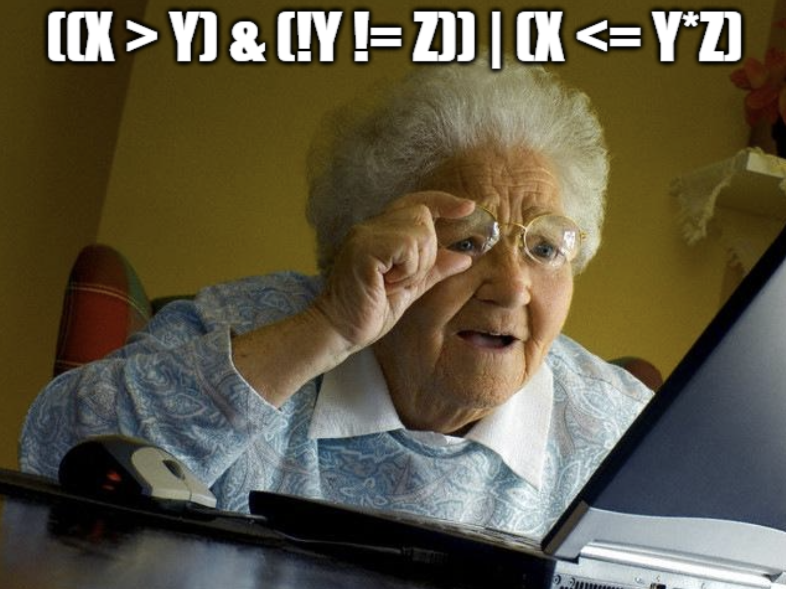

```{r setup, include=FALSE}
knitr::opts_chunk$set(echo = TRUE)
```

```{css, echo=FALSE}
html {
  scroll-behavior: smooth;
}
```

```{=html}
<style type="text/css">
  .table {width: 60%;}
</style>
```

```{=html}
<style>
body {
  text-align: justify;
}
</style>
```

<style>
  h1.title { display: none; }
</style>

::: {style="text-align: right;"}
[Volver al inicio](../)
:::

<a id='top'></a>

# Objetos y operadores

## Objetos comunes en R

Como ya vimos anteriormente, R es un lenguaje orientado a objetos y existe una gran variedad de “cosas” que estos objetos pueden contener/almacenar. En general, los objetos que presentamos a continuación permiten realizar la mayoría de las tareas cotidianas en R.

| Objeto | Descripción |
|-------------------|-----------------------------------------------------|
| vector | Colección de objetos de un mismo tipo (números enteros, números reales, texto, etc.). Los vectores son los objetos básicos a partir de los cuales pueden crearse gran parte del resto de los objetos más relevantes en R. |
| data.frame | Tabla que contiene datos, conformada por una serie de columnas como vectores. Las columnas de un `data.frame` pueden ser vectores de distinto tipo. Generalmente, estos objetos son cargados por el usuario a partir de un archivo, pero también pueden ser creados con la función `data.frame()`. |
| matrix | Colección de vectores organizado en filas y columnas. A diferencia de un `data.frame`, es un objeto que permite operaciones matemáticas propias de las matrices (e.g., suma o producto de matrices). |
| list | Es una coleccion de objetos de cualquier tipo, sean vectores, tablas, matrices, otras listas y más. Gran parte de las salidas de las funciones de R son listas, por ejemplo, la salida de un modelo lineal con la funcion `lm()`. |

## Operadores

Un operador es una expresión, compuesta por uno o más símbolos, que realiza una operación específica sobre uno o más valores para producir un resultado.

### Operadores aritméticos

Relacionan dos números para generar un resultado.

| Símbolo | Operación            |
|:--------|:---------------------|
| `+`     | Suma                 |
| `-`     | Resta                |
| `*`     | Multiplicación       |
| `/`     | División             |
| `^`     | Potenciación         |
| `%/%`   | División entera      |
| `%%`    | Resto de la división |

Por ejemplo:

```{r}
5 + 7
```

```{r}
3^4
```

El uso de paréntesis muchas veces es necesario:

```{r}
3^(4+3)
```

```{r}
10 %/% 3
```

```{r}
10 %% 3
```

### Operadores relacionales

Relacionan un valor con otro y devuelven una constante lógica (`TRUE` o `FALSE`).

| Símbolo | Operación          |
|:--------|:-------------------|
| `<`     | Menor a...         |
| `<=`    | Menor o igual a..  |
| `>`     | Mayor a...         |
| `>=`    | Mayor o igual a... |
| `==`    | Igual a...         |
| `!=`    | Distinto de...     |

Por ejemplo:

```{r}
8 > 9
```

```{r}
8 >= 9
```

```{r}
5 == 5
```

```{r}
12 != 12
```

### Operadores lógicos o booleanos

<div style="display: flex; justify-content: space-between; align-items: flex-start;">

<div style="flex: 1; margin-right: 10px;">
Estos operadores devuelven una constante lógica (`TRUE` o `FALSE`).

| Símbolo | Operación        |
|:--------|:-----------------|
| `!`     | Negación         |
| `&`     | Y                |
| `&&`    | Y secuencial     |
| `|`     | O                |
| `||`    | O secuencial     |
| `xor`   | Unión excluyente |
</div>

<div style="flex: 1; margin-left: 10px; text-align: center;">

<p style="font-style: italic; font-size: 0.9em; margin-top: 5px;">George Boole, matemático inglés. En su honor, los operadores\
lógicos también se llaman "booleanos".</p>
</div>

</div>

<br>

Para entender cómo funcionan estos operadores las [tablas de verdad](https://es.wikipedia.org/wiki/Tabla_de_verdad){target="_blank"} son útiles. Aquí, aprenderemos el comportamiento de estos operadores mediante ejemplos.

El operador `!` devuelve el resultado opuesto de una expresión lógica dada:

```{r}
!(10 > 5)
```

El operador `&` (Y) combina dos o más expresiones, y devuelve `TRUE` sólo si todas las expresiones lógicas son verdaderas:

```{r}
(10 > 5) & (30 > 20)
```

En cambio, devuelve `FALSE` si alguna de ellas no es verdadera:

```{r}
(10 > 5) & (30 > 40)
```

El operador `|` (O) combina dos o más expresiones, y devuelve `TRUE` si al menos una de las expresiones lógicas son verdaderas:

```{r}
(10 > 5) | (30 > 40)
```

En cambio, devuelve `FALSE` si ninguna de las expresiones son verdaderas:

```{r}
(10 > 15) | (30 > 40)
```

El operador `xor` es en realidad una función con dos argumentos. Sólo devuelve `TRUE` cuando una condición es verdadera y la otra es falsa:

```{r}
xor(10 > 5, 30 > 40)
```

En cambio, devuelve `FALSE` cuando ambas expresiones son verdaderas:

```{r}
xor(10 > 5, 30 > 20)
```

O ambas son falsas:

```{r}
xor(10 > 15, 30 > 40)
```

Los operadores `&&` y `||` trabajan secuencialmente, sólo evalúan la segunda condición si la primera es `TRUE`. Si la primera condición ya es `FALSE`, no se evalúa la segunda condición. Adquieren mayor sentido cuando el segundo elemento de la comparación no está definido, y suele utilizarse en contextos de programación más avanzada. Por ejemplo:

```{r}
a <- 5
a < 3 && b > 10
```

Aquí vemos que el objeto `b` no existe en el ambiente de R. Sin embargo, el resultado es `FALSE` porque la primera condición ya es falsa. Si hiciéramos la misma comparación con `&`, R devuelve un error:

```{r error=TRUE}
a <- 5
a < 3 & b > 10
```

Veamos un ejemplo similar con el operador `||`:

```{r}
a <- 5
a > 3 || b > 10
```

El resultado es `TRUE`, porque la primera condición ya es verdadera. El mismo código con `|` arroja un error:

```{r error=TRUE}
a <- 5
a > 3 | b > 10
```

Las funciones `all()` y `any()` permiten evaluar más de una condición simultáneamente. La función `all()` devuelve `TRUE` si todas las condiciones indicadas son verdaderas, caso contrario devuelve `FALSE`. Su comportamiento es análogo al operador `&` utilizado secuencialmente. Las condiciones se escriben de a una y separadas por coma. Por ejemplo:

```{r}
a <- 5
b <- 10
c <- 15
all(a > 3, b > 8, c > 11)
```

Todas las condiciones son verdaderas, por lo que devuelve `TRUE`. Si en cambio al menos una es falsa, obtenemos `FALSE`:

```{r}
all(a > 3, b > 8, c > 21)
```

La función `any()` devuelve `TRUE` si al menos una condición es verdadera. Su comportamiento es análogo al operador `|` utilizado de manera secuencial. Por ejemplo:

```{r}
any(a > 7, b > 12, c > 13)
```

En cambio, si todas las condiciones son falsas, `any()` devuelve `FALSE`:

```{r}
any(a > 7, b > 12, c > 23)
```

#### <ins>Ejercicios</ins>

1.  La variable `y` puede calcularse mediante la siguiente fórmula:

$$ \hspace{-9cm} y = a + b\sqrt{x+2} + cx^2 $$

Siendo `a = 5.3`, `b = 3.2` y `c = 1.7`, calcule el valor de `y` cuando `x = 20`.

2.  Sin correr las siguientes líneas, ¿cuál es el resultado de cada expresión?

```{r results='hide'}
x <- 10
y <- 90

(x <= 10) & (y > 40)
(x == 10) | (y == 89)
((x > 5) & (y != 70)) & (x*y > 1000)
```

3.  ¿Qué hacen las funciones `round()`, `floor()`, `ceiling()` y `trunc()`?

```{r results='hide'}
round(x = 6.756)
round(6.756, digits = 2)
trunc(6.756)
ceiling(6.756)
floor(x = 6.756)
```

<br>

<p align="center"><a href="pics/meme_practico_operadores.png" target="_blank"></a></p>

<br>

::: {style="text-align: right;"}
[Ir arriba](#top)
:::
