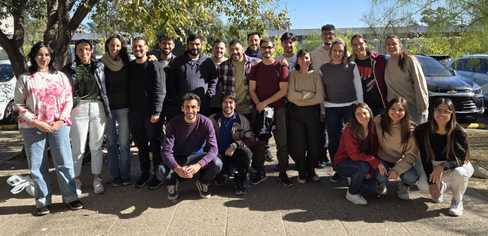
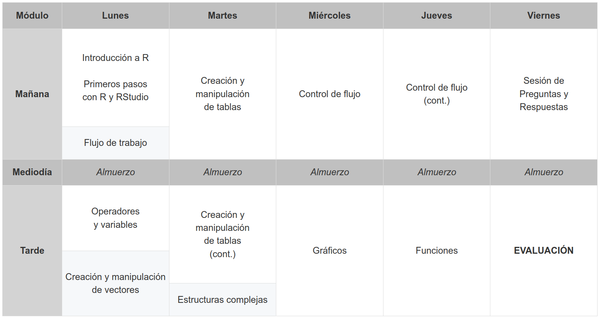

<font size=5>Curso de posgrado \| Doctorado en Cs. Biológicas \| FCEFyN - UNC</font>

<p align="center" style="margin: 0; padding: 0;">



::: {style="
    width: 66rem;
    max-width: 100%;
    margin: 0 auto;
    text-align: right;
    white-space: nowrap;
    display: flex;
    justify-content: flex-end;
    align-items: center;
    gap: 4px;
  "}
<a href="#"
     id="btn2025"
     onclick="changePhoto('2025'); return false;"
     style="text-decoration: none; font-weight: bold; color: #444441; display: inline;"> <i><sup>Edición 2025</sup></i> </a> [  ]{style="display: inline; color: #444441;"} <a href="#"
     id="btn2024"
     onclick="changePhoto('2024'); return false;"
     style="text-decoration: none; font-weight: normal; color: #444441; display: inline;"> <i><sup>Edición 2024</sup></i> </a>
:::

</p>

```{=html}
<script>
function changePhoto(year) {
  const img = document.getElementById("main-photo");
  const btn2024 = document.getElementById("btn2024");
  const btn2025 = document.getElementById("btn2025");
  // Fade out
  img.style.opacity = 0;
  setTimeout(() => {
    // Cambiar imagen
    if(year === "2025") {
      img.src = "pics/foto_2025.jpg";
      btn2025.style.fontWeight = "bold";
      btn2024.style.fontWeight = "normal";
    } else {
      img.src = "pics/foto_2024.jpg";
      btn2024.style.fontWeight = "bold";
      btn2025.style.fontWeight = "normal";
    }
    // Fade in
    img.style.opacity = 1;
  }, 400);
}
</script>
```

# ¡Bienvenid\@s al curso!

Bienvenid\@s al curso de **Fundamentos básicos del lenguaje R**, dictado por el Dr. Pablo Yair Huais y el Dr. Nicolás Pastor. El curso fue diseñado para proveer a l\@s estudiantes con las herramientas necesarias para iniciarse en el uso del lenguaje R, mediante el aprendizaje de su lógica programática, y orientado a resolver problemas específicos de sus temas de investigación.

A la izquierda de la pantalla se encuentran disponibles todos los recursos prácticos y teóricos que utilizaremos durante el desarrollo del curso.

# Objetivos del curso

-   Que l\@s estudiantes adquieran conceptos teóricos fundamentales y habilidades prácticas básicas del lenguaje R.
-   Que l\@s estudiantes desarrollen un pensamiento programático en relación al uso del lenguaje R.
-   Que l\@s estudiantes sean capaces de trasladar las herramientas aprendidas para la resolución de problemas metodológicos específicos de sus investigaciones.

# Cronograma {#cronograma}

<p align="center">

<a href="pics/cronograma.png" target="_blank"> </a>

</p>

```{=html}
<!---

# Evaluación 2025

[Haz click aquí para acceder a la evaluación del curso](unidad5/Evaluacion.html){target="_blank"}

--->
```

# Descarga el material del curso

[Click aquí](https://github.com/curso-statsCBA/fundamentos_R/archive/refs/heads/main.zip) para descargar el contenido del curso para su acceso sin conexión a internet. Para acceder a la página del curso de manera local, abra el archivo "index.html" con su navegador de internet, ubicado dentro de la carpeta "docs" del directorio descargado.

# Otros cursos de interés

En el Doctorado de Ciencias Biológicas (FCEFyN, Universidad Nacional de Córdoba), se dictan con regularidad cursos introductorios y avanzados de modelos estadísticos en R:

-   **Introducción al lenguaje R. Modelos lineales y fundamentos de programación** <br>Dictado por el Dr. Santiago Benitez-Vieyra. [Ver curso](https://curso-statscba.github.io/curso-R/){target="_blank"}
-   **Modelos Estadísticos Avanzados** <br>Dictado por el Dr. Santiago Benitez-Vieyra. [Ver curso](https://curso-statscba.github.io/modelos_avanzados/){target="_blank"}
-   **Gráficos para publicaciones en R con énfasis en *ggplot2*** <br>Dictado por el Dr. Andrés Blanco. [Ver curso](https://andresblanco-unc.github.io/curso_graficos_ggplot/){target="_blank"}

# Licencia

© 2024-2025 Pablo Y. Huais & Nicolás Pastor. Bajo licencia [Creative Commons Attribution-NonCommercial-ShareAlike 4.0 International License](http://creativecommons.org/licenses/by-nc-sa/4.0/).

<a href="http://creativecommons.org/licenses/by-nc-sa/4.0/" target="_blank"> </a>
