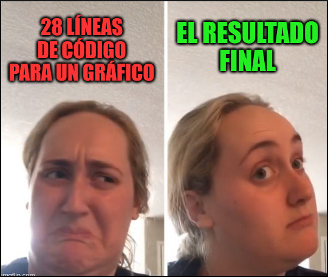

## El apartado gráfico de R

La representación gráfica de datos y resultados es una parte importante de nuestro quehacer habitual en ámbitos académicos y científicos. Una de las razones de la gran popularidad de R yace en su excelente apartado gráfico, con el cual se pueden producir gráficos de buena calidad listos para publicar. De forma general, existen <u id='comentario'>dos métodos principales</u> para realizar gráficos en R: el basado en el sistema básico de `R base` y el basado en el paquete `ggplot2`. Ambas opciones poseen sus propias ventajas y desventajas y generalmente son usados a la par. Es decir, en algunas ocasiones convendrá o será más cómodo, utilizar uno y, en otras ocasiones, será mejor opción el otro.

```{r, echo=FALSE}
tippy::tippy_this(elementId = 'comentario', interactive= 'true', tooltip = "<span style='font-size:14px;'>Existen otros paquetes que profundizan funcionalidades específicas que trascienden los objetivos de este curso. Aquí puede encontrar <a href='https://www.geeksforgeeks.org/top-r-libraries-for-data-visualization/' target='_blank'>una lista de los paquetes top en 2024</a> según un sitio especializado.</span>")
```

En esta clase veremos como construir gráficos con `R base`. Para empezar, definiremos un concepto relativo al *nivel* de la función utilizada. Cuando grafiquemos podremos utilizaremos funciones de *alto nivel*, que son aquellas funciones que crean nuevos gráficos, generalmente junto a los principales ejes, etiquetas ó títulos (e.g. `plot()`, `hist()`, etc.); y funciones de *bajo nivel*, que son aquellas con las que podremos añadir elementos extras a un gráfico ya creado, como puntos, líneas, flechas u otras etiquetas (e.g. `points()`, `text()`, etc.). La **combinación de funciones de alto y bajo nivel nos permite realizar una enorme personalización del gráfico**, aunque en algunas ocasiones esto puede llevar a que tengamos que definir cada aspecto del mismo. Este compromiso entre el nivel de personalización deseado y la cantidad de líneas de código necesarias puede parecer un poco abrumador al comienzo; pero, luego de un tiempo, en general optaremos siempre por una completa personalización. Sumado a esto, con el tiempo acumularemos plantillas propias para ciertos tipos de gráficos que realicemos frecuentemente, y solo nos bastará con cambiar los datos y algunos parámetros menores para obtener un nuevo gráfico listo para su publicación (o al menos su revisión 😬).

En cuanto a los **tipos de gráficos**, las posibilidades que ofrece R son realmente ilimitadas y podrían constituir en sí mismo un curso de representación gráfica. Por ello, para aprender los fundamentos del funcionamiento del apartado gráfico, veremos a continuación dos tipos de gráficos:

-   **Histogramas**: nos permiten ver la distribución de frecuencia en nuestros datos.
-   **Gráficos de dispersión (*scatterplots*)**: nos permiten evaluar la relación entre variables cuantitativas.
-   **Gráficos de caja (*boxplot*)**: posibilitan comparar, entre categorías, la distribución cuantitativa de los datos basada en sus cuartiles y mostrando, además, intervalos de confianza y valores atípicos (*outliers*).

En cuanto a la **personalización de los gráficos**, intentaremos a continuación abordarlo desde una perspectiva progresiva, partiendo de los gráficos simples elaborados con funciones de alto nivel, para luego ir sumando parámetros y funciones de bajo nivel, haciendo más complejo nuestro código para definir los principales elementos que componen un gráfico.

### Un gráfico simple

En el primer día de clases, ya realizamos nuestro primer gráfico sencillo. Podemos, con todo lo que sabemos ahora, entender perfectamente cómo funciona el siguiente código:

```{r eval=F, echo=T, fig.align='center', fig.height=3, fig.width=4}
plot(1:3, rep(1,3), pch=16, col=c("blue","red","black"), cex=5)
```

```{r eval=T, echo=F, fig.align='center', fig.height=3}
par(mar = c(2, 2, 1, 2))
plot(1:3, rep(1,3), pch=16, col=c("blue","red","black"), cex=5)
```

Empezando por los datos, ya sabemos que la expresión `1:3` genera un vector compuesto por `1,2,3`, así mismo `rep(1,3)` está generando una repetición de 1, tres veces, es decir: `1,1,1`. La función `plot()` espera 2 argumentos posicionales correspondientes a las coordenadas `x` e `y`, respectivamente. Por ende, lo que estamos haciendo es indicar que las posiciones para el eje `x=(1,2,3)` y las posiciones para el eje `y=(1,1,1)`. De allí que los 3 puntos graficados se ubiquen en las coordenadas `(x,y)=(1,1),(1,2),(1,3)`.

#### *Los parámetros básicos* `pch`*,* `col` *y* `cex`

Con estos tres parámetros básicos de la función `plot()` podemos indicar qué tipo de **marcador** se graficará (`pch`), qué **colores** queremos que estos marcadores tengan y qué **tamaño relativo** queremos que tengan (`cex`). Debajo podemos ver un ejemplo, pero nunca está de más tener a mano una carta de referencia descargada en nuestra PC o un sitio que podamos [consultar online](https://r-charts.com/){target="_bank"}. Notar que a los colores podemos indicarlos con un *número* del 1 al 8 (luego comienzan a ciclarse) como se muestra aquí abajo, o con sus *nombres* (e.g. '*black*', '*red*', etc.) como en el ejemplo previo; así como también podemos usar notación [hexadecimal o RGB](https://r-charts.com/colors/){target="\"_blank"}.

```{r eval=T, echo=F, fig.align='center', fig.height=5, fig.width=12}
par(mar = c(2, 3, 1, 1))
num <- 0 ; 
num1 <- 0
plot(0,0 , xlim=c(0,26) , ylim=c(0.5,3.5), col="white" , xaxt="n", yaxt="n" , ylab="" , xlab="")
#fill the graph
for (i in seq(1,25)){
  points(i,1 , pch=i , cex=3, col="black" , bg="lightblue")
  points(i,2 , col=i , pch=16 , cex=3)
  points(i,3 , col="black" , bg="lightblue", pch=21 , cex=i*0.25)
}
for (i in seq(1,25)){
  text(i, 1-0.25 , i, cex=0.9)
  text(i, 2-0.25 , i, cex=0.9)
  text(i, 3-0.3 , i*0.25, srt=0, adj=0.5, cex=0.9)
}
#add axis
axis(2, at = c(1,2,3), labels = c("pch" , "col" , "cex"), 
     tick = TRUE, col = "black", las = 1, cex.axis = 1, font.axis=2)
```

## Ejercicio 1

Utilizando como molde el código del gráfico previo, intente realizar uno que posea 3 puntos en las coordenadas `(x,y)=(1,3),(2,1),(3,2)`, que estos puntos sean rombos de color azul, amarillo y rojo, respectivamente, todos con borde negro, y que su tamaño relativo sea distinto y creciente, como se muestra a continuación:

```{r eval=T, echo=F, fig.align='center', fig.height=4, fig.width=5}
par(mar = c(3, 2, 1, 1))
plot(1:3, c(3,1,2), pch=23, col="black", bg=c("blue","yellow","red"), cex=c(1,2,3))
```

*Ayuda*: los valores de `cex` recomendados son `1,2,3`. Para las formas con borde y relleno, `col` solo especifica el color del borde. Busque por sus medios qué parámetro permite indicar el color de relleno.

## Histogramas

Los histogramas son gráficos que nos permiten visualizar la distribución de frecuencia de los datos. Son muy utilizados en el *análisis exploratorio* de los datos. Graficar histogramas en R es sumamente sencillo gracias a la función `hist()`, una función de alto nivel que permite realizarlos. Para el siguiente ejemplo, visualizaremos una distribución normal de 1.000 observaciones con `media = 0` y `desviación estándar = 0` .

```{r eval=T, echo=T, fig.align='center', fig.height=4, fig.width=5}
hist(rnorm(1000))
```

### *Editando títulos y etiquetas de ejes*

Como podemos ver, el gráfico muestra una serie de barras con la frecuencia acumulada de los valores por intervalos igualmente espaciados. Así mismo, como se trata de una función de alto nivel, ya posee configurado algunas cuestiones, como las etiquetas de los ejes y el título. Para modificar esto último podríamos incluir los parámetros `xlab` e `ylab`, para las etiquetas de los ejes `x` e `y`, respectivamente y `main` para el título:

```{r eval=T, echo=T, fig.align='center', fig.height=4, fig.width=6}
hist(rnorm(1000),
     main = "Histograma de Distribución Normal",
     xlab = "Valores observados",
     ylab = "Frecuencias"
)
```

## Ejercicio 2

Ayudándose con la documentación de las funciones `hist()` y `rnorm()`:

a)  Grafique un histograma correspondiente a un ensayo de medición de la altura de una población para los cuales se midieron 350 personas y se obtuvo un valor promedio de 175 cm, con una desviación estándar de 5 cm.

b)  Imagine que este ensayo se repitió en diferentes localidades, y ahora se encuentra con 30.000 observaciones, con media 173,47 cm y desviación estándar de 4,03 cm. Le han pedido que realice un nuevo histograma y le han informado que la editorial donde va a ser publicado el informe ha solicitado que el mismo posea título, etiquetas, colores de relleno y borde de las barras del histograma, muy específicos. Para tal fin, le han adjuntado el ejemplo que se muestra debajo. Realice el nuevo gráfico y guárdelo en la carpeta correspondiente a `dia4`.

```{r eval=T, echo=F, fig.align='center', fig.height=4, fig.width=6}
hist(rnorm(30000, 173.47, 4.03),
     col = "pink",
     border = "blue",
     main = "Altura de la población",
     xlab = "Valores observados (cm)",
     ylab = "Frecuencia poblacional"
)
```

c)  Puede que su gráfico se vea muy parecido, más no igual al ejemplo. De hecho, cada vez que llama a la función gráfica observará que el gráfico cambia, ¿por qué sucede esto?

## Gráfico de dispersión

Muchas veces necesitamos evaluar si existe una relación entre 2 variables cuantitativas. Una de las mejores formas de representar gráficamente estas relaciones es mediante gráficos de dispersión. A continuación un ejemplo utilizando el conjunto de datos `iris`, con el que ya debería estar muy familiarizado.

```{r eval=F, echo=T, fig.align='center', fig.height=5, fig.width=5}
with(iris, plot(Petal.Length, Sepal.Length, 
                pch = 21, col = "black", bg = "forestgreen", cex = 1,
                xlim = c(0, 8),
                ylim = c(0, 8)
                )
     )
```

```{r eval=T, echo=F, fig.align='center', fig.height=5, fig.width=5}
par(mar=c(4,4,1,1))
with(iris, plot(Petal.Length, Sepal.Length, 
                pch= 21, col="black", bg="forestgreen", cex=1,
                xlim=c(0, 8),
                ylim=c(0, 8)))
```

**Para pensar:** En el código precedente apareció `with()`, una función que previamente no habíamos utilizado. Analice el código y trate de descifrar qué ventajas tiene su uso. Por supuesto, siempre puede consultar la ayuda con `?with()`.

### *Límites gráficos*

En el código del gráfico previo, aparecieron algunas novedades: los parámetros `xlim` e `ylim`. Como puede imaginarse, se trata de los parámetros para fijar los límites de los ejes. Ambos parámetros esperan un vector de largo 2 con los rangos de las coordenadas de `x` e `y`, y son muy útiles a la hora de crear una base gráfica sin ningún contenido, para luego rellenar con nuestros datos. Esta forma de trabajo es muy extendida al trabajar con gráficos básicos en R, y para ello cuando llamamos a la función `plot()` debemos indicarle que el gráfico sea vacío, con el parámetro `typ = "n"`.

Antes de probar su funcionamiento, prestemos atención al origen de coordenadas del gráfico (i.e. `(x,y)=(0,0)`). Si nos fijamos bien, veremos que esa coordenada no coincide exactamente con el ángulo inferior izquierdo del gráfico. Esto es debido a que, por defecto, R utiliza una función interna para extender levemente los ejes (ahora que lo notamos, podemos ver que sucede también en los extremos de los ejes). Si no deseamos este comportamiento, podemos utilizar los parámetros `xaxs` e `yaxs`. Estos parámetros tienen dos configuraciones posibles: `"r"` o `"i"` (de "regular" e "interno"), veamos cómo funcionan:

```{r eval=F, echo=T, fig.align='center', fig.height=3, fig.width=3}
plot(0,0, xlim = c(0, 100), ylim = c(0, 50), typ = "n", xaxs = "r", yaxs = "i")
```

```{r eval=T, echo=F, fig.align='center', fig.height=3, fig.width=3}
par(mar=c(2,2,1,1))
plot(0,0, xlim=c(0, 100), ylim=c(0, 50), typ='n', xaxs="r",yaxs="i")
```

### *Añadiendo otros elementos a nuestro gráfico*

En el gráfico de dispersión, muchas veces es interesante mostrar el resultado de la correlación entre las variables de forma gráfica, es decir, la línea (o curva) resultante del ajuste de un modelo de regresión entre las variables. Teniendo en cuenta el mismo conjunto de datos con el que venimos trabajando, recordemos primero cómo podemos obtener la regresión lineal usando la función `lm()`.

```{r eval=T, echo=T}
lm(Sepal.Length ~ Petal.Length, data = iris)
```

Como podemos ver, la función `lm()` ya nos devuelve el intercepto y la pendiente de la recta que queremos graficar. Con el uso de la función `abline()`, podemos añadirla al gráfico:

```{r eval=F, echo=T, fig.align='center', fig.height=5, fig.width=5}
# plot() -> función de alto nivel, crea la base del gráfico
with(iris, plot(Petal.Length, Sepal.Length,
                pch= 21, col="black", bg="forestgreen", cex=1,
                xlim=c(0, 8),
                ylim=c(0,8)))
# abline() -> función de bajo nivel, añade la recta al gráfico ya creado
with(iris, abline(lm(Sepal.Length ~ Petal.Length)))
```

```{r eval=T, echo=F, fig.align='center', fig.height=5, fig.width=5}
par(mar=c(4,4,1,1))
with(iris, plot(Petal.Length, Sepal.Length, 
                pch= 21, col="black", bg="forestgreen", cex=1,
                xlim=c(0, 8),
                ylim=c(0,8)))
with(iris, abline(lm(Sepal.Length ~ Petal.Length)))
```

Así como añadimos la recta resultante de la regresión, con `abline()` podemos añadir tantas líneas verticales y horizontales como necesitemos, esto es muy útil para separar sectores del gráfico, hacer líneas de divisiones menores de los ejes, etc. Además, podemos llamar a otra función de bajo nivel como es `text()`, para agregar sobre el gráfico los valores que componen la ecuación de la recta:

```{r eval=F, echo=T, fig.align='center', fig.height=5, fig.width=5}
# Primero guardemos los resultados de la regresión en un nuevo objeto
reg_l <- lm(Sepal.Length ~ Petal.Length, data = iris)

# Gráfico base
with(iris, plot(Petal.Length, Sepal.Length,
                pch= 21, col="black", bg="forestgreen", cex=1,
                xlim=c(0, 8),
                ylim=c(0,8)))
# Añadimos líneas
abline(v = c(2, 4, 6), h = c(2, 4, 6), col = "grey", lwd = 0.5)
abline(reg_l)
# Añadiomos texto
text(3.5, 0, paste0("La ecuación es: y = ",
                    round(reg_l$coefficients[2],2),
                    "x", " + ",
                    round(reg_l$coefficients[1],2)),
     cex=0.9, adj=0)
```

```{r eval=T, echo=F, fig.align='center', fig.height=5, fig.width=5}
reg_l <- with(iris, lm(Sepal.Length ~ Petal.Length))
par(mar=c(4,4,1,1))
with(iris, plot(Petal.Length, Sepal.Length, 
                pch= 21, col="black", bg="forestgreen", cex=1,
                xlim=c(0, 8),
                ylim=c(0,8)))
abline(v=c(2,4,6), h=c(2,4,6), col="grey", lwd=0.5)
abline(reg_l)
text(3.5,0, paste0("La ecuación es: y = ",
                   round(reg_l$coefficients[2],2),
                   "x", " + ",
                   round(reg_l$coefficients[1],2)),
     cex=0.9, adj=0)
```

### *Personalizando parámetros según los datos*

En muchas ocasiones, necesitamos que en nuestro gráfico los colores o los marcadores se correspondan con alguna variable, ya sea esta cuantitativa o cualitativa. Existen diferentes formas de abordar esta situación que dependerán en gran medida de la complejidad y el tamaño del conjunto de datos, así como de la diversidad de parámetros que debamos modificar.

Una aproximación sencilla es generar en nuestro conjunto de datos una nueva variable que contenga los valores (numéricos o de texto) del parámetro gráfico que necesitemos modificar. Otra forma puede ser utilizar un vector con nombres, que relacione las variables de los datos con los valores de los parámetros gráficos.

```{r eval=T, echo=T}
# Creando un nuevo data.frame para graficar incluyendo una columna con colores por especie
toplot <- iris[,c(1,3,5)]
toplot$Spe.Color <- ifelse(toplot$Species == "setosa", "forestgreen",
                           ifelse(toplot$Species == "versicolor", "dodgerblue",
                                  "red")
                           )
toplot[sample(nrow(toplot), 10),]
```

```{r eval=F, echo=T, fig.align='center', fig.height=6, fig.width=6}
# Creando una referencia para los marcadores, según la especie
pch_ref <- c("setosa" = 21,
             "versicolor" = 22,
             "virginica" = 23)
# Creando una referencia para los colores, según la especie
col_ref <- c("setosa" = "forestgreen",
             "versicolor" = "dodgerblue",
             "virginica" = "red")
# Llamando al gráfico
with(toplot, plot(Sepal.Length, Petal.Length,
                  pch = pch_ref[as.character(Species)],
                  col = "black", bg = Spe.Color, cex = 1.5,
                  xlim = c(0, 8),
                  ylim = c(0,8)
                  )
)
# Usando un for para añadir lineas de ajuste por especie
with(toplot,
     for (spe in unique(Species)) {
       abline(lm(Petal.Length ~ Sepal.Length,
                 data = subset(toplot, Species == spe)),
              col = col_ref[as.character(spe)], lwd = 3, lty = 3)
     }
)
```

```{r eval=T, echo=F, fig.align='center', fig.height=6, fig.width=6}
par(mar=c(4,4,1,1))
# Creando un nuevo data.frame para graficar incluyendo una columna con colores por especie
toplot <- iris[,c(1,3,5)]
toplot$Spe.Color <- ifelse(toplot$Species == "setosa", "forestgreen",
                     ifelse(toplot$Species == "versicolor", "dodgerblue",
                            "red"))
# Creando una referencia para los marcadores, según la especie
pch_ref <- c("setosa" = 21,
             "versicolor" = 22,
             "virginica" = 23)
# Creando una referencia para los colores, según la especie
col_ref <- c("setosa" = "forestgreen",
             "versicolor" = "dodgerblue",
             "virginica" = "red")
# Llamando al gráfico
with(toplot, plot(Sepal.Length, Petal.Length,
                pch = pch_ref[as.character(Species)],
                col = "black", bg = Spe.Color, cex=1.5,
                xlim = c(0, 8),
                ylim = c(0,8)
                )
     )
# Usando un for para añadir lineas de ajuste por especie
with(toplot,
     for (spe in unique(Species)) {
       abline(lm(Petal.Length ~ Sepal.Length,
                 data = subset(toplot, Species == spe)),
              col = col_ref[as.character(spe)], lwd = 3, lty = 3)
       }
     )
```

### *Editando los ejes del gráfico*

En algunas ocasiones, quisiéramos que el gráfico no presentará el recuadro que lo rodea. Esto podemos lograrlo removiendo los ejes con el parámetro `axes = FALSE`.

```{r eval=F, echo=T, fig.align='center', fig.height=5, fig.width=5}
# Llamando al gráfico
with(toplot, plot(Sepal.Length, Petal.Length,
                pch = pch_ref[as.character(Species)],
                col = "black", bg = Spe.Color, cex=1.5,
                xlim = c(0, 8),
                ylim = c(0,8),
                axes=FALSE
                )
     )
```

```{r eval=T, echo=F, fig.align='center', fig.height=4, fig.width=4}
# Llamando al gráfico
par(mar=c(5,5,1,1))
with(toplot, plot(Sepal.Length, Petal.Length,
                pch = pch_ref[as.character(Species)],
                col = "black", bg = Spe.Color, cex=1.5,
                xlim = c(0, 8),
                ylim = c(0,8),
                axes = FALSE
                )
     )
```

Por supuesto, ahora debemos *añadir manualmente* los ejes del gráfico. Para ello, usaremos otra función de bajo nivel llamada `axis()` (recuerde revisar la documentación para ver todas sus opciones) y, si así queremos, `box()` para dibujar una sección específica del recuadro que enmarca el gráfico.

```{r eval=F, echo=T, fig.align='center', fig.height=5, fig.width=5}
# Llamando al gráfico
with(toplot, plot(Sepal.Length, Petal.Length,
                pch = pch_ref[as.character(Species)],
                col = "black", bg = Spe.Color, cex=1.5,
                xlim = c(0, 8),
                ylim = c(0,8),
                xaxs = "i", yaxs = "i",
                axes = FALSE
                )
     )
axis(side = 1, at = c(0,4:8))
axis(side = 2, at = seq(0,8,2), las = 1, labels = c("cero", "dos", 4, "seis", 8))
box(bty = "l")
```

```{r eval=T, echo=F, fig.align='center', fig.height=5, fig.width=5}
# Llamando al gráfico
par(mar=c(5,5,1,1))
with(toplot, plot(Sepal.Length, Petal.Length,
                pch = pch_ref[as.character(Species)],
                col = "black", bg = Spe.Color, cex=1.5,
                xlim = c(0, 8),
                ylim = c(0,8),
                xaxs="i", yaxs="i",
                axes=FALSE
                )
     )
# Añadimos los ejes y el recuadro
axis(side=1, at=c(0,4:8))
axis(side=2, at=seq(0,8,2), las=1, labels=c("cero", "dos", 4, "seis", 8))
box(bty="l")
```

## Gráficos de caja

### *Leyendas y anotaciones*

A continuación, cambiaremos el conjunto de datos por `ToohGrowth`, proveniente de un experimento de crecimiento dental en cobayos, según la dosis de dos suplementos dietarios. Este tipo de experimentos es perfecto para poner en práctica la función `boxplot()`, para crear gráficos de caja. Como en este punto ya conocemos la lógica de construcción de gráficos, pasemos directamente al código:

```{r eval=F, echo=T, fig.align='center', fig.height=5, fig.width=5}
# Llamado del primer conjunto de cajas (tratamiento = "VC")
with(subset(ToothGrowth, supp == "VC"),
     boxplot(len ~ dose, axes = FALSE, ylim = c(0, 35),
             boxwex = 0.15, at = 1:3 - 0.1, 
             col = "yellow", main = "Crecimiento dental",
             xlab = "Dosis de Vitamina C (mg/día)", ylab = "Largo del odontoblasto (µm)",
             )
     )
# Llamado del segundo conjunto de cajas (tratamiento = "OJ")
# Notar el uso de "add = TRUE" y "ann = FALSE"
with(subset(ToothGrowth, supp == "OJ"),
     boxplot(len ~ dose,  axes = FALSE, add = TRUE, ann = FALSE,
             boxwex = 0.15, at = 1:3 + 0.1,
             col = "orange"
             )
     )
# Creando los ejes y recuadro
axis(side = 1, at = c(1:3), labels = c("0.5", "1", "2"))
axis(side = 2, at = seq(0,35,5))
box(bty = "l", lwd = 2)
# Graficando la flecha para señalar el outlier
with(subset(ToothGrowth, supp == "VC" & dose == 1),
     arrows(x0 = 1.5, x1 = 1.8,
            y0 = max(len), y1 = max(len),
            lwd = 2, col = "red"
  )
)
# Anadiendo la leyenda
legend("bottom", horiz = TRUE, bty = "n",
       legend = c("Ácido ascórbico", "Jugo de naranja"),
       fill = c("yellow", "orange"))
```

```{r eval=T, echo=F, fig.align='center', fig.height=6, fig.width=6}
with(subset(ToothGrowth, supp == "VC"),
     boxplot(len ~ dose,
             boxwex = 0.15, at = 1:3 - 0.1, axes = FALSE, ylim = c(0, 35),
             col = "yellow", main = "Crecimiento dental",
             xlab = "Dosis de Vitamina C (mg/día)", ylab = "Largo del odontoblasto (µm)",
             )
     )
with(subset(ToothGrowth,  supp == "OJ"),
     boxplot(len ~ dose, add = TRUE, ann = F, axes = FALSE,
             boxwex = 0.15, at = 1:3 + 0.1,
             col = "orange"
             )
     )
axis(side=1, at=c(1:3), labels=c("0.5", "1", "2"))
axis(side=2, at=seq(0,35,5))
box(bty="l", lwd=2)
with(subset(ToothGrowth, supp == "VC" & dose == 1),
     arrows(x0 = 1.5, x1 = 1.8,
            y0 = max(len), y1 = max(len),
            lwd = 2, col = "red"
  )
)
legend("bottom", horiz=TRUE, bty = "n",
       c("Ácido ascórbico", "Jugo de naranja"),
       fill = c("yellow", "orange"))
```

## Ejercicio 3

a)  Analice el código precedente sin ejecutarlo, intentando describir qué hace cada línea. Luego, copie el mismo a un script dentro de `dia4` y ejecútelo por partes para entender el funcionamiento. Recuerde buscar en las ayudas interna de R y juegue con las opciones disponibles.
b)  Repita el gráfico pero con una flecha azul que indique el valor de la mediana para la 0,5 mm/día del suplemento jugo de naranja. Además, ubique la leyenda en la posición `(x,y) = (2.5,5)`.

<br>

## Panel de múltiples gráficos

En muchas ocasiones, necesitamos mostrar en un solo panel varios gráficos diferentes. Para ello, debemos utilizar la función `par()`, que permite configurar todos los parámetros básicos del dispositivo gráfico que usa R. Esta función tiene un nivel jerárquico superior a todas las que vimos previamente, ya que con la misma podemos cambiar el comportamiento *por defecto* de todos los parámetros gráficos de forma semi-permanente (i.e. en el contexto de RStudio, durante toda la sesión en curso; y para dispositivos gráficos externos, hasta que se reinicie el mismo). Por esto, si realizamos un cambio con `par()` para mostrar dos gráficos en paralelo y, posteriormente, queremos realizar un nuevo gráfico solitario, debemos volver a configurar el dispositivo gráfico para mostrar un solo gráfico.

A pesar de la gran cantidad de usos que posee la función par(), dentro de los más comunes están la configuración de márgenes interiores (`mar`/`mai`) y exteriores (`oma` y `omi`), así como la configuración del emplazamiento de múltiples gráficos (`mfrow`).

Para ver esto último en acción, pensemos que queremos realizar una regresión lineal y evaluar si los supuestos de la misma se cumplen. Para ellos, hagamos primero un modelo de regresión lineal entre las variables `Petal.Length` y `Sepal.Length`, para la especie *I. virginica* del conjunto de datos `iris`:

```{r eval=T, echo=T, fig.align='center', fig.height=8, fig.width=8}
# Creando y viendo el resultado del modelo de regresión lineal
regL <- lm(Petal.Length ~ Sepal.Length, data = subset(iris[iris$Species == "virginica",]))
summary(regL)
```

Habiendo generado el objeto que contiene el resultado de `lm()`, podemos pedirle a R que lo grafique con `plot()`. Este es un ejemplo más de la característica de *polimorfismo* que vimos en la [clase introductoria](../unidad1/IntroR.qmd){target="_blank"}, ya que `plot()` puede usarse sobre diferentes tipos de objetos, resultantes de diferentes funciones, y realizará diferentes gráficos según cada uno.

Como en nuestro ejemplo la función `plot()`realizará 4 gráficos separados, configuraremos con `par()` la posibilidad de tener un panel de 4 gráficos, con 2 filas y 2 columnas, esto es: `mfrow = c(2,2)`.

```{r eval=T, echo=T, fig.align='center', fig.height=8, fig.width=8}
# Gráficos de diagnóstico del modelo de regresión lineal
par(mfrow = c(2,2))
plot(regL)
```

Si bien el análisis y explicación de cada uno de estos gráficos excede este curso, puede encontrar [en este vínculo](https://library.virginia.edu/data/articles/diagnostic-plots){target="_blank"} una buena explicación con ejemplos. Además, **puede inscribirse en la próxima edición del excelente curso dictado por Santiago Benitez-Vieyra**: [Introducción al lenguaje R. Modelos lineales y fundamentos de programación.](https://curso-statscba.github.io/curso-R/){target="_blank"}

Para jugar un poco más, repitamos los gráficos pero ahora, pidiendo que los mismos estén emplazados en una sola fila de 4 columnas:

```{r eval=T, echo=T, fig.align='center', fig.height=4, fig.width=10}
# Gráficos de diagnóstico del modelo de regresión lineal
par(mfrow = c(1,4))
plot(regL)
```

## Ejercicio final

Con el conjunto de datos provisto, y ayudándose con la documentación de las funciones `points()`, `segments()` y `title()`, y buscando cómo funcionan los parámetros gráficos para líneas `lwd` y `lty`, realice un gráfico como el que se muestra a continuación.

```{r eval=T, echo=T}
data <- data.frame(tipo = c("linea solida","linea guiones","linea punteada", rep("punto",4)),
                   lposy = c(1,3,5, rep(NA,4)),
                   lposx0 = c(rep(1,3), rep(NA, 4)),
                   lposx1 = c(rep(4,3), rep(NA, 4)),
                   pposx = c(rep(NA,3), 6,6,8,8),
                   pposy = c(rep(NA,3), 2,4,2,4))
data 
```

```{r eval=T, echo=F, fig.align='center', fig.height=7, fig.width=7}
par(mar=c(2,2,3,1))
plot(0,0, typ="n", xlab="", ylab="", xlim=c(0,10), ylim=c(0,6), axes = FALSE)
axis(side=1, at=c(6,8))
axis(side=2, at=c(2,4))
box(bty="o")
with(data, abline(v=pposx, h=pposy))
with(subset(data, tipo == "punto"),
     points(pposx, pposy, cex=3, 
            pch = c(21,22,23,24),
            col = "black",
            bg = c("red", "dodgerblue", "orange", "forestgreen")))
with(subset(data, tipo != "punto"),
     segments(x0=lposx0, x1=lposx1, y0=lposy, y1=lposy,
              lwd=4, lty=c(1,2,3)))
with(subset(data, tipo != "punto"),
     text(lposx0, lposy+0.5, tipo, adj=0))
title("Graficando con R base")
```

-----------------------------------------------------------------------------

::: {style="text-align: center;"}

<a href="pics/plotbasememe.jpeg" target="_blank"> </a>

:::
